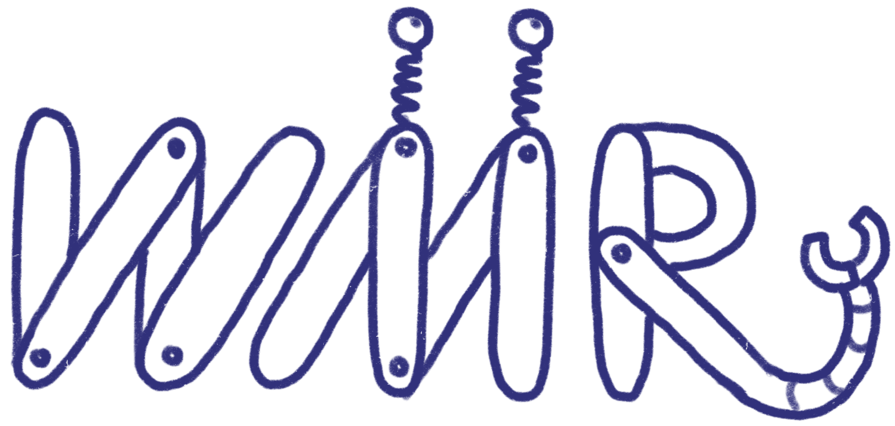

---VON _W M R_, VON _W M R_, SIND DIE BESTEN RO BO TER---
~Company Slogan, est. 2847
#We Manufacture Robots - Manual

## Introduction
Hello fellow Robot maintenance guy-. Yuu are the backbone of our Company, but you can't work without knowing the gist of our bots. So follow this manual carefully and everything will be fine. If you have problems. Well shit. We won't solve them.

## Robocatalogue
 --Also on Casette or Datasette, write our customer support.

- A00100234
- A00100235
- A00100236
- THE DESTROYER OF WORLDS
- Bendr Bend Rodruigez
- Wall-B
- iRobot
- DeliverBot 3000.001
- DeliverBot 3000.006
- Snansbot Mk. 1
- Snansbot Mk. 2
- Snansbot Mk. III
- Snansbot 9k Ultra
- B008135
- B008135 Special_69
- Working Drone v.7
- Working Drone X
- WoodchopBot
- W M R - ロボット
- Robot 1
- Steel Man

Please note that this is just a small selection of our best robots you could ever imagine. For the full catalogue of every bot to suit your project, please send a e-mail to support@wmr-international.nope. For business related inquiries, please send a mail to pr@wmr-international.dont or send a fax to +49-FAXBOT###1337 haha, who uses faxmachines anymore.

### A00100234

#### Prelude

The A00100234 is the best of it's kind. It's extraordinarily suited for every operation imaginable. You can deploy it anywhere you want and give it any task you like. You don't believe this? Well. Fuck you too. We build the best Robots in the entire world. Please buy lots of them and use them how ever you like.

#### Technical Details
- Polygoncount: Unbelievable
- 1200 Enemies on screen at the same time
- Over 49 Meggerpixels of Screendissolution
- 62 Giganbutts of RAM
- 720.000

#### Important Codecs
|Usage |Code|
|---|---|
|Selfdestruction|KILLME|
|GodMode|AVEMARIA|
|NoClip|ALLYOURBASEAREBELONGTOUS|
|Restarting the Visual Sensors| 185487422986848452321586|
|99 Extra Lives|⬆ ⬆ ⬇ ⬇ ⬅ ➡ ⬅ ➡ 🅱 🅰 🆗|
|Endless Cash|Rosebud|

#### Disclaimer
WMR assumes no liability in the event of any relevance that could occur anywhere or at all under the given circumstances. Everything that can happen will probably happen, but we are not guilty of it, nor will we ever be to blame for it. Use at your own risk, risk and responsibility. Parents are responsible for their children, blah, you know the drill, no one will read this shit anyway.

467/5000
W M R（私たちはロボットを製造しています）は、特定の状況下でどこでも、またはまったく発生する可能性のある関連性については責任を負いません。 起こる可能性のあることはすべて起こるでしょうが、私たちはそれを犯したり、責任を負ったりすることはありません。 あなた自身のリスク、リスク、責任で使用してください。 親は子供たちに責任があります、なんと、ドリルを知っている、とにかく誰もこのたわごとを読まないでしょう。

### A00100235

#### Prelude

The A00100235 is the best of it's kind. It's extraordinarily suited for every operation imaginable. You can deploy it anywhere you want and give it any task you like. You don't believe this? Well. Fuck you too. We build the best Robots in the entire world. Please buy lots of them and use them how ever you like.

#### Technical Details
- Polygoncount: Unbelievable
- 1200 Enemies on screen at the same time
- Over 49 Meggerpixels of Screendissolution
- 62 Giganbutts of RAM
- 720.000

#### Important Codecs
|Usage |Code|
|---|---|
|Selfdestruction|KILLME|
|GodMode|AVEMARIA|
|NoClip|ALLYOURBASEAREBELONGTOUS|
|Restarting the Visual Sensors| 185487422986848452321586|
|99 Extra Lives|⬆ ⬆ ⬇ ⬇ ⬅ ➡ ⬅ ➡ 🅱 🅰 🆗|
|Endless Cash|Rosebud|

#### Disclaimer
WMR assumes no liability in the event of any relevance that could occur anywhere or at all under the given circumstances. Everything that can happen will probably happen, but we are not guilty of it, nor will we ever be to blame for it. Use at your own risk, risk and responsibility. Parents are responsible for their children, blah, you know the drill, no one will read this shit anyway.

467/5000
W M R（私たちはロボットを製造しています）は、特定の状況下でどこでも、またはまったく発生する可能性のある関連性については責任を負いません。 起こる可能性のあることはすべて起こるでしょうが、私たちはそれを犯したり、責任を負ったりすることはありません。 あなた自身のリスク、リスク、責任で使用してください。 親は子供たちに責任があります、なんと、ドリルを知っている、とにかく誰もこのたわごとを読まないでしょう。

### A00100236

#### Prelude

The A00100236 is the best of it's kind. It's extraordinarily suited for every operation imaginable. You can deploy it anywhere you want and give it any task you like. You don't believe this? Well. Fuck you too. We build the best Robots in the entire world. Please buy lots of them and use them how ever you like.

#### Technical Details
- Polygoncount: Unbelievable
- 1200 Enemies on screen at the same time
- Over 49 Meggerpixels of Screendissolution
- 62 Giganbutts of RAM
- 720.000

#### Important Codecs
|Usage |Code|
|---|---|
|Selfdestruction|KILLME|
|GodMode|AVEMARIA|
|NoClip|ALLYOURBASEAREBELONGTOUS|
|Restarting the Visual Sensors| 185487422986848452321586|
|99 Extra Lives|⬆ ⬆ ⬇ ⬇ ⬅ ➡ ⬅ ➡ 🅱 🅰 🆗|
|Endless Cash|Rosebud|

#### Disclaimer
WMR assumes no liability in the event of any relevance that could occur anywhere or at all under the given circumstances. Everything that can happen will probably happen, but we are not guilty of it, nor will we ever be to blame for it. Use at your own risk, risk and responsibility. Parents are responsible for their children, blah, you know the drill, no one will read this shit anyway.

467/5000
W M R（私たちはロボットを製造しています）は、特定の状況下でどこでも、またはまったく発生する可能性のある関連性については責任を負いません。 起こる可能性のあることはすべて起こるでしょうが、私たちはそれを犯したり、責任を負ったりすることはありません。 あなた自身のリスク、リスク、責任で使用してください。 親は子供たちに責任があります、なんと、ドリルを知っている、とにかく誰もこのたわごとを読まないでしょう。

### THE DESTROYER OF WORLDS

#### Prelude

The DESTROYER OF WORLDS is the best of it's kind. It's extraordinarily suited for every operation imaginable. You can deploy it anywhere you want and give it any task you like. You don't believe this? Well. Fuck you too. We build the best Robots in the entire world. Please buy lots of them and use them how ever you like.

#### Technical Details
- Polygoncount: Unbelievable
- 1200 Enemies on screen at the same time
- Over 49 Meggerpixels of Screendissolution
- 62 Giganbutts of RAM
- 720.000

#### Important Codecs
|Usage |Code|
|---|---|
|Selfdestruction|KILLME|
|GodMode|AVEMARIA|
|NoClip|ALLYOURBASEAREBELONGTOUS|
|Restarting the Visual Sensors| 185487422986848452321586|
|99 Extra Lives|⬆ ⬆ ⬇ ⬇ ⬅ ➡ ⬅ ➡ 🅱 🅰 🆗|
|Endless Cash|Rosebud|

#### Disclaimer
WMR assumes no liability in the event of any relevance that could occur anywhere or at all under the given circumstances. Everything that can happen will probably happen, but we are not guilty of it, nor will we ever be to blame for it. Use at your own risk, risk and responsibility. Parents are responsible for their children, blah, you know the drill, no one will read this shit anyway.

467/5000
W M R（私たちはロボットを製造しています）は、特定の状況下でどこでも、またはまったく発生する可能性のある関連性については責任を負いません。 起こる可能性のあることはすべて起こるでしょうが、私たちはそれを犯したり、責任を負ったりすることはありません。 あなた自身のリスク、リスク、責任で使用してください。 親は子供たちに責任があります、なんと、ドリルを知っている、とにかく誰もこのたわごとを読まないでしょう。

### Bendr Bend Rodruigez

#### Prelude

The Bot is the best of it's kind. It's extraordinarily suited for every operation imaginable. You can deploy it anywhere you want and give it any task you like. You don't believe this? Well. Fuck you too. We build the best Robots in the entire world. Please buy lots of them and use them how ever you like.

#### Technical Details
- Polygoncount: Unbelievable
- 1200 Enemies on screen at the same time
- Over 49 Meggerpixels of Screendissolution
- 62 Giganbutts of RAM
- 720.000

#### Important Codecs
|Usage |Code|
|---|---|
|Selfdestruction|KILLME|
|GodMode|AVEMARIA|
|NoClip|ALLYOURBASEAREBELONGTOUS|
|Restarting the Visual Sensors| 185487422986848452321586|
|99 Extra Lives|⬆ ⬆ ⬇ ⬇ ⬅ ➡ ⬅ ➡ 🅱 🅰 🆗|
|Endless Cash|Rosebud|

#### Disclaimer
WMR assumes no liability in the event of any relevance that could occur anywhere or at all under the given circumstances. Everything that can happen will probably happen, but we are not guilty of it, nor will we ever be to blame for it. Use at your own risk, risk and responsibility. Parents are responsible for their children, blah, you know the drill, no one will read this shit anyway.

467/5000
W M R（私たちはロボットを製造しています）は、特定の状況下でどこでも、またはまったく発生する可能性のある関連性については責任を負いません。 起こる可能性のあることはすべて起こるでしょうが、私たちはそれを犯したり、責任を負ったりすることはありません。 あなた自身のリスク、リスク、責任で使用してください。 親は子供たちに責任があります、なんと、ドリルを知っている、とにかく誰もこのたわごとを読まないでしょう。

### Wall-B

#### Prelude

The WALL-B is the best of it's kind. It's extraordinarily suited for every operation imaginable. You can deploy it anywhere you want and give it any task you like. You don't believe this? Well. Fuck you too. We build the best Robots in the entire world. Please buy lots of them and use them how ever you like.

#### Technical Details
- Polygoncount: Unbelievable
- 1200 Enemies on screen at the same time
- Over 49 Meggerpixels of Screendissolution
- 62 Giganbutts of RAM
- 720.000

#### Important Codecs
|Usage |Code|
|---|---|
|Selfdestruction|KILLME|
|GodMode|AVEMARIA|
|NoClip|ALLYOURBASEAREBELONGTOUS|
|Restarting the Visual Sensors| 185487422986848452321586|
|99 Extra Lives|⬆ ⬆ ⬇ ⬇ ⬅ ➡ ⬅ ➡ 🅱 🅰 🆗|
|Endless Cash|Rosebud|

#### Disclaimer
WMR assumes no liability in the event of any relevance that could occur anywhere or at all under the given circumstances. Everything that can happen will probably happen, but we are not guilty of it, nor will we ever be to blame for it. Use at your own risk, risk and responsibility. Parents are responsible for their children, blah, you know the drill, no one will read this shit anyway.

467/5000
W M R（私たちはロボットを製造しています）は、特定の状況下でどこでも、またはまったく発生する可能性のある関連性については責任を負いません。 起こる可能性のあることはすべて起こるでしょうが、私たちはそれを犯したり、責任を負ったりすることはありません。 あなた自身のリスク、リスク、責任で使用してください。 親は子供たちに責任があります、なんと、ドリルを知っている、とにかく誰もこのたわごとを読まないでしょう。

### iRobot

#### Prelude

The iRobot is the best of it's kind. It's extraordinarily suited for every operation imaginable. You can deploy it anywhere you want and give it any task you like. You don't believe this? Well. Fuck you too. We build the best Robots in the entire world. Please buy lots of them and use them how ever you like.

#### Technical Details
- Polygoncount: Unbelievable
- 1200 Enemies on screen at the same time
- Over 49 Meggerpixels of Screendissolution
- 62 Giganbutts of RAM
- 720.000

#### Important Codecs
|Usage |Code|
|---|---|
|Selfdestruction|KILLME|
|GodMode|AVEMARIA|
|NoClip|ALLYOURBASEAREBELONGTOUS|
|Restarting the Visual Sensors| 185487422986848452321586|
|99 Extra Lives|⬆ ⬆ ⬇ ⬇ ⬅ ➡ ⬅ ➡ 🅱 🅰 🆗|
|Endless Cash|Rosebud|

#### Disclaimer
WMR assumes no liability in the event of any relevance that could occur anywhere or at all under the given circumstances. Everything that can happen will probably happen, but we are not guilty of it, nor will we ever be to blame for it. Use at your own risk, risk and responsibility. Parents are responsible for their children, blah, you know the drill, no one will read this shit anyway.

467/5000
W M R（私たちはロボットを製造しています）は、特定の状況下でどこでも、またはまったく発生する可能性のある関連性については責任を負いません。 起こる可能性のあることはすべて起こるでしょうが、私たちはそれを犯したり、責任を負ったりすることはありません。 あなた自身のリスク、リスク、責任で使用してください。 親は子供たちに責任があります、なんと、ドリルを知っている、とにかく誰もこのたわごとを読まないでしょう。

### DeliverBot 3000.001

#### Prelude

The DeliverBot 3000.001 is the best of it's kind. It's extraordinarily suited for every operation imaginable. You can deploy it anywhere you want and give it any task you like. You don't believe this? Well. Fuck you too. We build the best Robots in the entire world. Please buy lots of them and use them how ever you like.

#### Technical Details
- Polygoncount: Unbelievable
- 1200 Enemies on screen at the same time
- Over 49 Meggerpixels of Screendissolution
- 62 Giganbutts of RAM
- 720.000

#### Important Codecs
|Usage |Code|
|---|---|
|Selfdestruction|KILLME|
|GodMode|AVEMARIA|
|NoClip|ALLYOURBASEAREBELONGTOUS|
|Restarting the Visual Sensors| 52365478874511236699548|
|99 Extra Lives|⬆ ⬆ ⬇ ⬇ ⬅ ➡ ⬅ ➡ 🅱 🅰 🆗|
|Endless Cash|Rosebud|

#### Disclaimer
WMR assumes no liability in the event of any relevance that could occur anywhere or at all under the given circumstances. Everything that can happen will probably happen, but we are not guilty of it, nor will we ever be to blame for it. Use at your own risk, risk and responsibility. Parents are responsible for their children, blah, you know the drill, no one will read this shit anyway.

467/5000
W M R（私たちはロボットを製造しています）は、特定の状況下でどこでも、またはまったく発生する可能性のある関連性については責任を負いません。 起こる可能性のあることはすべて起こるでしょうが、私たちはそれを犯したり、責任を負ったりすることはありません。 あなた自身のリスク、リスク、責任で使用してください。 親は子供たちに責任があります、なんと、ドリルを知っている、とにかく誰もこのたわごとを読まないでしょう。

### DeliverBot 3000.006

#### Prelude

The DeliverBot 3000.006 is the best of it's kind. It's extraordinarily suited for every operation imaginable. You can deploy it anywhere you want and give it any task you like. You don't believe this? Well. Fuck you too. We build the best Robots in the entire world. Please buy lots of them and use them how ever you like.

#### Technical Details
- Polygoncount: Unbelievable
- 1200 Enemies on screen at the same time
- Over 49 Meggerpixels of Screendissolution
- 62 Giganbutts of RAM
- 720.000

#### Important Codecs
|Usage |Code|
|---|---|
|Selfdestruction|KILLME|
|GodMode|AVEMARIA|
|NoClip|ALLYOURBASEAREBELONGTOUS|
|Restarting the Visual Sensors| 584828564272835184|
|99 Extra Lives|⬆ ⬆ ⬇ ⬇ ⬅ ➡ ⬅ ➡ 🅱 🅰 🆗|
|Endless Cash|Rosebud|

#### Disclaimer
WMR assumes no liability in the event of any relevance that could occur anywhere or at all under the given circumstances. Everything that can happen will probably happen, but we are not guilty of it, nor will we ever be to blame for it. Use at your own risk, risk and responsibility. Parents are responsible for their children, blah, you know the drill, no one will read this shit anyway.

467/5000
W M R（私たちはロボットを製造しています）は、特定の状況下でどこでも、またはまったく発生する可能性のある関連性については責任を負いません。 起こる可能性のあることはすべて起こるでしょうが、私たちはそれを犯したり、責任を負ったりすることはありません。 あなた自身のリスク、リスク、責任で使用してください。 親は子供たちに責任があります、なんと、ドリルを知っている、とにかく誰もこのたわごとを読まないでしょう。

### Snansbot Mk. 1

#### Prelude

The Snansbot Mk. 1 is the best of it's kind. It's extraordinarily suited for every operation imaginable. You can deploy it anywhere you want and give it any task you like. You don't believe this? Well. Fuck you too. We build the best Robots in the entire world. Please buy lots of them and use them how ever you like.

#### Technical Details
- Polygoncount: Unbelievable
- 1200 Enemies on screen at the same time
- Over 49 Meggerpixels of Screendissolution
- 62 Giganbutts of RAM
- 720.000

#### Important Codecs
|Usage |Code|
|---|---|
|Selfdestruction|KILLME|
|GodMode|AVEMARIA|
|NoClip|ALLYOURBASEAREBELONGTOUS|
|Restarting the Visual Sensors| 185487422986848452321586|
|99 Extra Lives|⬆ ⬆ ⬇ ⬇ ⬅ ➡ ⬅ ➡ 🅱 🅰 🆗|
|Endless Cash|Rosebud|

#### Disclaimer
WMR assumes no liability in the event of any relevance that could occur anywhere or at all under the given circumstances. Everything that can happen will probably happen, but we are not guilty of it, nor will we ever be to blame for it. Use at your own risk, risk and responsibility. Parents are responsible for their children, blah, you know the drill, no one will read this shit anyway.

467/5000
W M R（私たちはロボットを製造しています）は、特定の状況下でどこでも、またはまったく発生する可能性のある関連性については責任を負いません。 起こる可能性のあることはすべて起こるでしょうが、私たちはそれを犯したり、責任を負ったりすることはありません。 あなた自身のリスク、リスク、責任で使用してください。 親は子供たちに責任があります、なんと、ドリルを知っている、とにかく誰もこのたわごとを読まないでしょう。

### Snansbot Mk. 2

#### Prelude

The Snansbot Mk. 2 is the best of it's kind. It's extraordinarily suited for every operation imaginable. You can deploy it anywhere you want and give it any task you like. You don't believe this? Well. Fuck you too. We build the best Robots in the entire world. Please buy lots of them and use them how ever you like.

#### Technical Details
- Polygoncount: Unbelievable
- 1200 Enemies on screen at the same time
- Over 49 Meggerpixels of Screendissolution
- 62 Giganbutts of RAM
- 720.000

#### Important Codecs
|Usage |Code|
|---|---|
|Selfdestruction|KILLME|
|GodMode|AVEMARIA|
|NoClip|ALLYOURBASEAREBELONGTOUS|
|Restarting the Visual Sensors| 185487422986848452321586|
|99 Extra Lives|⬆ ⬆ ⬇ ⬇ ⬅ ➡ ⬅ ➡ 🅱 🅰 🆗|
|Endless Cash|Rosebud|

#### Disclaimer
WMR assumes no liability in the event of any relevance that could occur anywhere or at all under the given circumstances. Everything that can happen will probably happen, but we are not guilty of it, nor will we ever be to blame for it. Use at your own risk, risk and responsibility. Parents are responsible for their children, blah, you know the drill, no one will read this shit anyway.

467/5000
W M R（私たちはロボットを製造しています）は、特定の状況下でどこでも、またはまったく発生する可能性のある関連性については責任を負いません。 起こる可能性のあることはすべて起こるでしょうが、私たちはそれを犯したり、責任を負ったりすることはありません。 あなた自身のリスク、リスク、責任で使用してください。 親は子供たちに責任があります、なんと、ドリルを知っている、とにかく誰もこのたわごとを読まないでしょう。

### Snansbot Mk. III

#### Prelude

The Snansbot Mk. III is the best of it's kind. It's extraordinarily suited for every operation imaginable. You can deploy it anywhere you want and give it any task you like. You don't believe this? Well. Fuck you too. We build the best Robots in the entire world. Please buy lots of them and use them how ever you like.

#### Technical Details
- Polygoncount: Unbelievable
- 1200 Enemies on screen at the same time
- Over 49 Meggerpixels of Screendissolution
- 62 Giganbutts of RAM
- 720.000

#### Important Codecs
|Usage |Code|
|---|---|
|Selfdestruction|KILLME|
|GodMode|AVEMARIA|
|NoClip|ALLYOURBASEAREBELONGTOUS|
|Restarting the Visual Sensors| 185487422986848452321586|
|99 Extra Lives|⬆ ⬆ ⬇ ⬇ ⬅ ➡ ⬅ ➡ 🅱 🅰 🆗|
|Endless Cash|Rosebud|

#### Disclaimer
WMR assumes no liability in the event of any relevance that could occur anywhere or at all under the given circumstances. Everything that can happen will probably happen, but we are not guilty of it, nor will we ever be to blame for it. Use at your own risk, risk and responsibility. Parents are responsible for their children, blah, you know the drill, no one will read this shit anyway.

467/5000
W M R（私たちはロボットを製造しています）は、特定の状況下でどこでも、またはまったく発生する可能性のある関連性については責任を負いません。 起こる可能性のあることはすべて起こるでしょうが、私たちはそれを犯したり、責任を負ったりすることはありません。 あなた自身のリスク、リスク、責任で使用してください。 親は子供たちに責任があります、なんと、ドリルを知っている、とにかく誰もこのたわごとを読まないでしょう。

### Snansbot 9k Ultra

#### Prelude

The Snansbot 9k Ultra is the best of it's kind. It's extraordinarily suited for every operation imaginable. You can deploy it anywhere you want and give it any task you like. You don't believe this? Well. Fuck you too. We build the best Robots in the entire world. Please buy lots of them and use them how ever you like.

#### Technical Details
- Polygoncount: Unbelievable
- 1200 Enemies on screen at the same time
- Over 49 Meggerpixels of Screendissolution
- 62 Giganbutts of RAM
- 720.000

#### Important Codecs
|Usage |Code|
|---|---|
|Selfdestruction|KILLME|
|GodMode|AVEMARIA|
|NoClip|ALLYOURBASEAREBELONGTOUS|
|Restarting the Visual Sensors| 185487422986848452321586|
|99 Extra Lives|⬆ ⬆ ⬇ ⬇ ⬅ ➡ ⬅ ➡ 🅱 🅰 🆗|
|Endless Cash|Rosebud|

#### Disclaimer
WMR assumes no liability in the event of any relevance that could occur anywhere or at all under the given circumstances. Everything that can happen will probably happen, but we are not guilty of it, nor will we ever be to blame for it. Use at your own risk, risk and responsibility. Parents are responsible for their children, blah, you know the drill, no one will read this shit anyway.

467/5000
W M R（私たちはロボットを製造しています）は、特定の状況下でどこでも、またはまったく発生する可能性のある関連性については責任を負いません。 起こる可能性のあることはすべて起こるでしょうが、私たちはそれを犯したり、責任を負ったりすることはありません。 あなた自身のリスク、リスク、責任で使用してください。 親は子供たちに責任があります、なんと、ドリルを知っている、とにかく誰もこのたわごとを読まないでしょう。

### B008135

#### Prelude

The B008135 is the best of it's kind. It's extraordinarily suited for every operation imaginable. You can deploy it anywhere you want and give it any task you like. You don't believe this? Well. Fuck you too. We build the best Robots in the entire world. Please buy lots of them and use them how ever you like.

#### Technical Details
- Polygoncount: Unbelievable
- 1200 Enemies on screen at the same time
- Over 49 Meggerpixels of Screendissolution
- 62 Giganbutts of RAM
- 720.000

#### Important Codecs
|Usage |Code|
|---|---|
|Selfdestruction|KILLME|
|GodMode|AVEMARIA|
|NoClip|ALLYOURBASEAREBELONGTOUS|
|Restarting the Visual Sensors| 185487422986848452321586|
|99 Extra Lives|⬆ ⬆ ⬇ ⬇ ⬅ ➡ ⬅ ➡ 🅱 🅰 🆗|
|Endless Cash|Rosebud|

#### Disclaimer
WMR assumes no liability in the event of any relevance that could occur anywhere or at all under the given circumstances. Everything that can happen will probably happen, but we are not guilty of it, nor will we ever be to blame for it. Use at your own risk, risk and responsibility. Parents are responsible for their children, blah, you know the drill, no one will read this shit anyway.

467/5000
W M R（私たちはロボットを製造しています）は、特定の状況下でどこでも、またはまったく発生する可能性のある関連性については責任を負いません。 起こる可能性のあることはすべて起こるでしょうが、私たちはそれを犯したり、責任を負ったりすることはありません。 あなた自身のリスク、リスク、責任で使用してください。 親は子供たちに責任があります、なんと、ドリルを知っている、とにかく誰もこのたわごとを読まないでしょう。

### B008135 Special_69

#### Prelude

The B008135 Special_69 is the best of it's kind. It's extraordinarily suited for every operation imaginable. You can deploy it anywhere you want and give it any task you like. You don't believe this? Well. Fuck you too. We build the best Robots in the entire world. Please buy lots of them and use them how ever you like.

#### Technical Details
- Polygoncount: Unbelievable
- 1200 Enemies on screen at the same time
- Over 49 Meggerpixels of Screendissolution
- 62 Giganbutts of RAM
- 720.000

#### Important Codecs
|Usage |Code|
|---|---|
|Selfdestruction|KILLME|
|GodMode|AVEMARIA|
|NoClip|ALLYOURBASEAREBELONGTOUS|
|Restarting the Visual Sensors| 185487422986848452321586|
|99 Extra Lives|⬆ ⬆ ⬇ ⬇ ⬅ ➡ ⬅ ➡ 🅱 🅰 🆗|
|Endless Cash|Rosebud|

#### Disclaimer
WMR assumes no liability in the event of any relevance that could occur anywhere or at all under the given circumstances. Everything that can happen will probably happen, but we are not guilty of it, nor will we ever be to blame for it. Use at your own risk, risk and responsibility. Parents are responsible for their children, blah, you know the drill, no one will read this shit anyway.

467/5000
W M R（私たちはロボットを製造しています）は、特定の状況下でどこでも、またはまったく発生する可能性のある関連性については責任を負いません。 起こる可能性のあることはすべて起こるでしょうが、私たちはそれを犯したり、責任を負ったりすることはありません。 あなた自身のリスク、リスク、責任で使用してください。 親は子供たちに責任があります、なんと、ドリルを知っている、とにかく誰もこのたわごとを読まないでしょう。

### Working Drone v.7

#### Prelude

The Working Drone v.7 is the best of it's kind. It's extraordinarily suited for every operation imaginable. You can deploy it anywhere you want and give it any task you like. You don't believe this? Well. Fuck you too. We build the best Robots in the entire world. Please buy lots of them and use them how ever you like.

#### Technical Details
- Polygoncount: Unbelievable
- 1200 Enemies on screen at the same time
- Over 49 Meggerpixels of Screendissolution
- 62 Giganbutts of RAM
- 720.000

#### Important Codecs
|Usage |Code|
|---|---|
|Selfdestruction|KILLME|
|GodMode|AVEMARIA|
|NoClip|ALLYOURBASEAREBELONGTOUS|
|Restarting the Visual Sensors| 185487422986848452321586|
|99 Extra Lives|⬆ ⬆ ⬇ ⬇ ⬅ ➡ ⬅ ➡ 🅱 🅰 🆗|
|Endless Cash|Rosebud|

#### Disclaimer
WMR assumes no liability in the event of any relevance that could occur anywhere or at all under the given circumstances. Everything that can happen will probably happen, but we are not guilty of it, nor will we ever be to blame for it. Use at your own risk, risk and responsibility. Parents are responsible for their children, blah, you know the drill, no one will read this shit anyway.

467/5000
W M R（私たちはロボットを製造しています）は、特定の状況下でどこでも、またはまったく発生する可能性のある関連性については責任を負いません。 起こる可能性のあることはすべて起こるでしょうが、私たちはそれを犯したり、責任を負ったりすることはありません。 あなた自身のリスク、リスク、責任で使用してください。 親は子供たちに責任があります、なんと、ドリルを知っている、とにかく誰もこのたわごとを読まないでしょう。

### Working Drone X

#### Prelude

The Working Drone X is the best of it's kind. It's extraordinarily suited for every operation imaginable. You can deploy it anywhere you want and give it any task you like. You don't believe this? Well. Fuck you too. We build the best Robots in the entire world. Please buy lots of them and use them how ever you like.

#### Technical Details
- Polygoncount: Unbelievable
- 1200 Enemies on screen at the same time
- Over 49 Meggerpixels of Screendissolution
- 62 Giganbutts of RAM
- 720.000

#### Important Codecs
|Usage |Code|
|---|---|
|Selfdestruction|KILLME|
|GodMode|AVEMARIA|
|NoClip|ALLYOURBASEAREBELONGTOUS|
|Restarting the Visual Sensors| 185487422986848452321586|
|99 Extra Lives|⬆ ⬆ ⬇ ⬇ ⬅ ➡ ⬅ ➡ 🅱 🅰 🆗|
|Endless Cash|Rosebud|

#### Disclaimer
WMR assumes no liability in the event of any relevance that could occur anywhere or at all under the given circumstances. Everything that can happen will probably happen, but we are not guilty of it, nor will we ever be to blame for it. Use at your own risk, risk and responsibility. Parents are responsible for their children, blah, you know the drill, no one will read this shit anyway.

467/5000
W M R（私たちはロボットを製造しています）は、特定の状況下でどこでも、またはまったく発生する可能性のある関連性については責任を負いません。 起こる可能性のあることはすべて起こるでしょうが、私たちはそれを犯したり、責任を負ったりすることはありません。 あなた自身のリスク、リスク、責任で使用してください。 親は子供たちに責任があります、なんと、ドリルを知っている、とにかく誰もこのたわごとを読まないでしょう。

### WoodchopBot

#### Prelude

The WoodchopBot is the best of it's kind. It's extraordinarily suited for every operation imaginable. You can deploy it anywhere you want and give it any task you like. You don't believe this? Well. Fuck you too. We build the best Robots in the entire world. Please buy lots of them and use them how ever you like.

#### Technical Details
- Polygoncount: Unbelievable
- 1200 Enemies on screen at the same time
- Over 49 Meggerpixels of Screendissolution
- 62 Giganbutts of RAM
- 720.000

#### Important Codecs
|Usage |Code|
|---|---|
|Selfdestruction|KILLME|
|GodMode|AVEMARIA|
|NoClip|ALLYOURBASEAREBELONGTOUS|
|Restarting the Visual Sensors| 185487422986848452321586|
|99 Extra Lives|⬆ ⬆ ⬇ ⬇ ⬅ ➡ ⬅ ➡ 🅱 🅰 🆗|
|Endless Cash|Rosebud|

#### Disclaimer
WMR assumes no liability in the event of any relevance that could occur anywhere or at all under the given circumstances. Everything that can happen will probably happen, but we are not guilty of it, nor will we ever be to blame for it. Use at your own risk, risk and responsibility. Parents are responsible for their children, blah, you know the drill, no one will read this shit anyway.

467/5000
W M R（私たちはロボットを製造しています）は、特定の状況下でどこでも、またはまったく発生する可能性のある関連性については責任を負いません。 起こる可能性のあることはすべて起こるでしょうが、私たちはそれを犯したり、責任を負ったりすることはありません。 あなた自身のリスク、リスク、責任で使用してください。 親は子供たちに責任があります、なんと、ドリルを知っている、とにかく誰もこのたわごとを読まないでしょう。

### W M R - ロボット

#### Prelude

The W M R - ロボット is the best of it's kind. It's extraordinarily suited for every operation imaginable. You can deploy it anywhere you want and give it any task you like. You don't believe this? Well. Fuck you too. We build the best Robots in the entire world. Please buy lots of them and use them how ever you like.

#### Technical Details
- Polygoncount: Unbelievable
- 1200 Enemies on screen at the same time
- Over 49 Meggerpixels of Screendissolution
- 62 Giganbutts of RAM
- 720.000

#### Important Codecs
|Usage |Code|
|---|---|
|Selfdestruction|KILLME|
|GodMode|AVEMARIA|
|NoClip|ALLYOURBASEAREBELONGTOUS|
|Restarting the Visual Sensors| 185487422986848452321586|
|99 Extra Lives|⬆ ⬆ ⬇ ⬇ ⬅ ➡ ⬅ ➡ 🅱 🅰 🆗|
|Endless Cash|Rosebud|

#### Disclaimer
WMR assumes no liability in the event of any relevance that could occur anywhere or at all under the given circumstances. Everything that can happen will probably happen, but we are not guilty of it, nor will we ever be to blame for it. Use at your own risk, risk and responsibility. Parents are responsible for their children, blah, you know the drill, no one will read this shit anyway.

467/5000
W M R（私たちはロボットを製造しています）は、特定の状況下でどこでも、またはまったく発生する可能性のある関連性については責任を負いません。 起こる可能性のあることはすべて起こるでしょうが、私たちはそれを犯したり、責任を負ったりすることはありません。 あなた自身のリスク、リスク、責任で使用してください。 親は子供たちに責任があります、なんと、ドリルを知っている、とにかく誰もこのたわごとを読まないでしょう。

### Robot-1

#### Prelude

The Robot-1 is the best of it's kind. It's extraordinarily suited for every operation imaginable. You can deploy it anywhere you want and give it any task you like. You don't believe this? Well. Fuck you too. We build the best Robots in the entire world. Please buy lots of them and use them how ever you like.

#### Technical Details
- Polygoncount: Unbelievable
- 1200 Enemies on screen at the same time
- Over 49 Meggerpixels of Screendissolution
- 62 Giganbutts of RAM
- 720.000

#### Important Codecs
|Usage |Code|
|---|---|
|Selfdestruction|KILLME|
|GodMode|AVEMARIA|
|NoClip|ALLYOURBASEAREBELONGTOUS|
|Restarting the Visual Sensors| 185487422986848452321586|
|99 Extra Lives|⬆ ⬆ ⬇ ⬇ ⬅ ➡ ⬅ ➡ 🅱 🅰 🆗|
|Endless Cash|Rosebud|

#### Disclaimer
WMR assumes no liability in the event of any relevance that could occur anywhere or at all under the given circumstances. Everything that can happen will probably happen, but we are not guilty of it, nor will we ever be to blame for it. Use at your own risk, risk and responsibility. Parents are responsible for their children, blah, you know the drill, no one will read this shit anyway.

467/5000
W M R（私たちはロボットを製造しています）は、特定の状況下でどこでも、またはまったく発生する可能性のある関連性については責任を負いません。 起こる可能性のあることはすべて起こるでしょうが、私たちはそれを犯したり、責任を負ったりすることはありません。 あなた自身のリスク、リスク、責任で使用してください。 親は子供たちに責任があります、なんと、ドリルを知っている、とにかく誰もこのたわごとを読まないでしょう。

### Steel Man

#### Prelude

The Steel Man is the best of it's kind. It's extraordinarily suited for every operation imaginable. You can deploy it anywhere you want and give it any task you like. You don't believe this? Well. Fuck you too. We build the best Robots in the entire world. Please buy lots of them and use them how ever you like.

#### Technical Details
- Polygoncount: Unbelievable
- 1200 Enemies on screen at the same time
- Over 49 Meggerpixels of Screendissolution
- 62 Giganbutts of RAM
- 720.000

#### Important Codecs
|Usage |Code|
|---|---|
|Selfdestruction|KILLME|
|GodMode|AVEMARIA|
|NoClip|ALLYOURBASEAREBELONGTOUS|
|Restarting the Visual Sensors| 185487422986848452321586|
|99 Extra Lives|⬆ ⬆ ⬇ ⬇ ⬅ ➡ ⬅ ➡ 🅱 🅰 🆗|
|Endless Cash|Rosebud|

#### Disclaimer
WMR assumes no liability in the event of any relevance that could occur anywhere or at all under the given circumstances. Everything that can happen will probably happen, but we are not guilty of it, nor will we ever be to blame for it. Use at your own risk, risk and responsibility. Parents are responsible for their children, blah, you know the drill, no one will read this shit anyway.

467/5000
W M R（私たちはロボットを製造しています）は、特定の状況下でどこでも、またはまったく発生する可能性のある関連性については責任を負いません。 起こる可能性のあることはすべて起こるでしょうが、私たちはそれを犯したり、責任を負ったりすることはありません。 あなた自身のリスク、リスク、責任で使用してください。 親は子供たちに責任があります、なんと、ドリルを知っている、とにかく誰もこのたわごとを読まないでしょう。

## General Troubleshooting
To restart the visual sensors, send the bot the following Message:
"Hokus Pokus Camerus Restartikus" followed by it's unique Restarting Codec found in the Robocatalogue. WMR is never guilty, ask our lawyers and over 7000 successfull lawsuits against anyone who dares to challenge us. Please buy our products.

## Special Thanks from the Boss
Hey People. I am the Boss. I just wanted to thank you for supporting our humble business. As everyone should know our biggest invention yet were the atomic bombs which destroyed the earth in 2021. Since then everything has been better and I am a hell lotta richer. HAHAHA I have more money than you. Good night, sir or madam or whatever. I don't care for you or anyone. I love Money!
  ~ The Boss
